# Profile App

## **Introduction 🌟**

We're going to build our first mobile app 📱 using [React Native](https://facebook.github.io/react-native/). We'll be using [Expo](https://expo.io/) to make getting started quick. Our app will help us to share information 📋 about ourselves to our friends 🍻🤗💁.

### Features 🥅🥇

- [ ] User can see our name
- [ ] User can see our age
- [ ] User can see our birthday
- [ ] User can see our profile picture
- [ ] User can see where we currently live
- [ ] User can see a short description about us

### Learning Objectives ✍️📚📝 📈🙌 ️

1. Learn how to create a new mobile app 📱using React Native & Expo:
    - Recognize it's a folder 🗂on our computer containing folders 📂 & files 📄📑 which have different responsibilities 🗝🎉.
2. Learn that `App.js` is a component like all other components, albeit, special:
    - Recognize it's parts ⚙will reflect how other components are built. It will need to import components for use & return 🚪JSX.
3. Learn that nesting components inside of `App.js` is how we'll build all our apps 📱: 
    - Recognize it will one day become the [parent component](https://stackoverflow.com/questions/44092105/what-is-the-difference-between-child-and-parent-component-in-angular-2) of all other components in our applications. This will happen through nesting. Some components will be parents 👫 and others will be their children 👨‍👩‍👧‍👦.
4. Learn that passing properties to components changes their behavior the way arguments to a function call change the return value:
    - Recognize that some components are classified as [functional](https://www.robinwieruch.de/react-function-component/). Like functions, the properties/props/params/arguments we pass them will effect their behavior.

No company you work at will expect you to work alone or without the help of resources available. We suggest you work in pairs and Google not only now but in future lessons.

> **Tip** 💡: The links provided in the introduction of all lessons will provide valuable information to you in class and your careers. It isn't a bad idea to spend a few minutes reading about these tools to understand how they fit together.

### **Milestone 1 🛣🏃 Create project directory and run application locally using Expo and simulator**

**A)** Open your terminal and navigate to the place you'll want to keep all the apps you'll build in the future saved on your computer. In my case it happens to be:

```
/Users/primetimetran/Desktop/coderschool
```

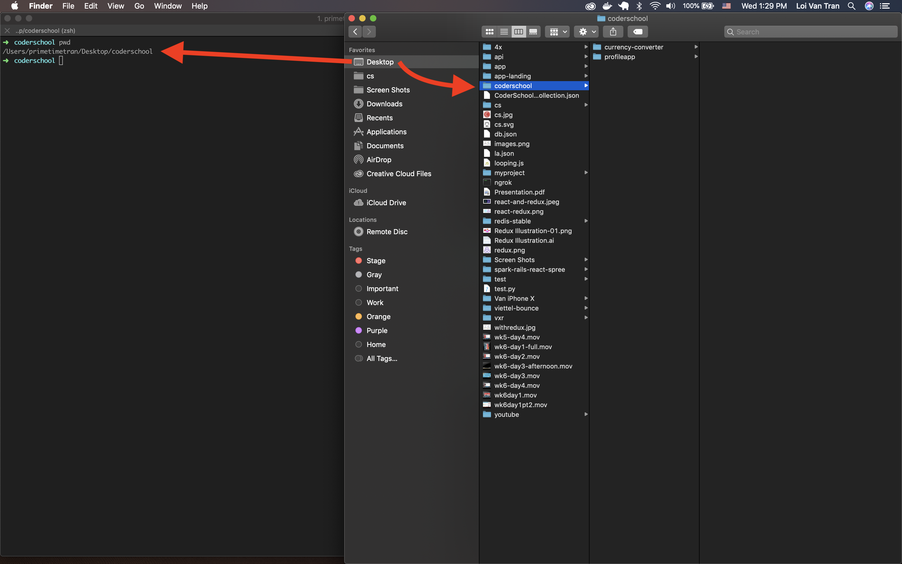

**B)** Run `expo init profileapp` in your terminal window. This command uses the [Expo CLI](https://docs.expo.io/versions/v33.0.0/workflow/up-and-running/) to create a folder which will contain all the files for this project, our `profileapp`. If you can't run the command consult [it's documentation](https://docs.expo.io/versions/v33.0.0/introduction/installation/), you may need other dependencies on your computer such a [node](https://nodejs.org/en/) or [npm](https://www.npmjs.com/).

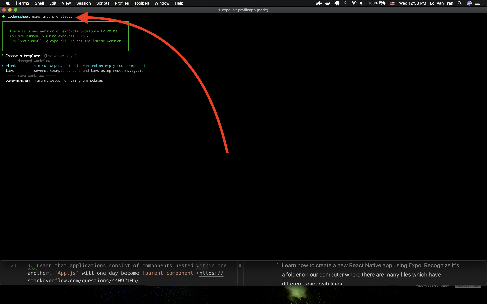

**C)** When prompted, select:

> 'blank' minimal dependencies to run and an empty root component

and press enter.

**D)** Now enter the name for the project again. This name should reflect what you'd call this on the App & Play stores.

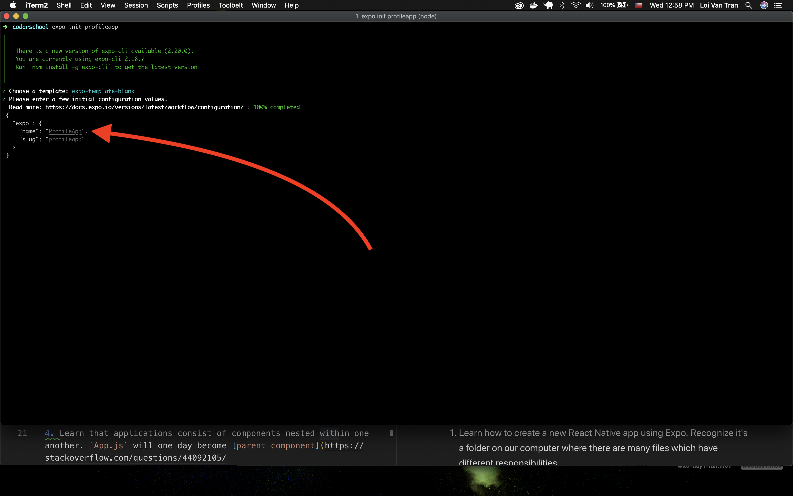

**E)** Enter `y` and hit enter when you're prompted to install using yarn.

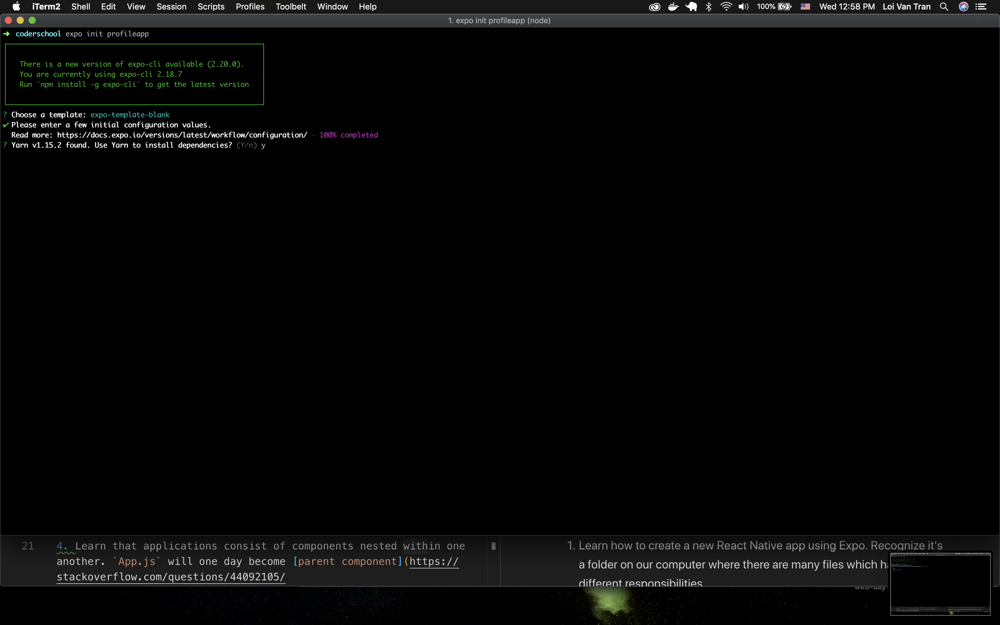

**F)** If everything went well, you should see a prompt/screen like this in your terminal window.
```
To get started you can type:
    cd profileapp
    yarn start
```

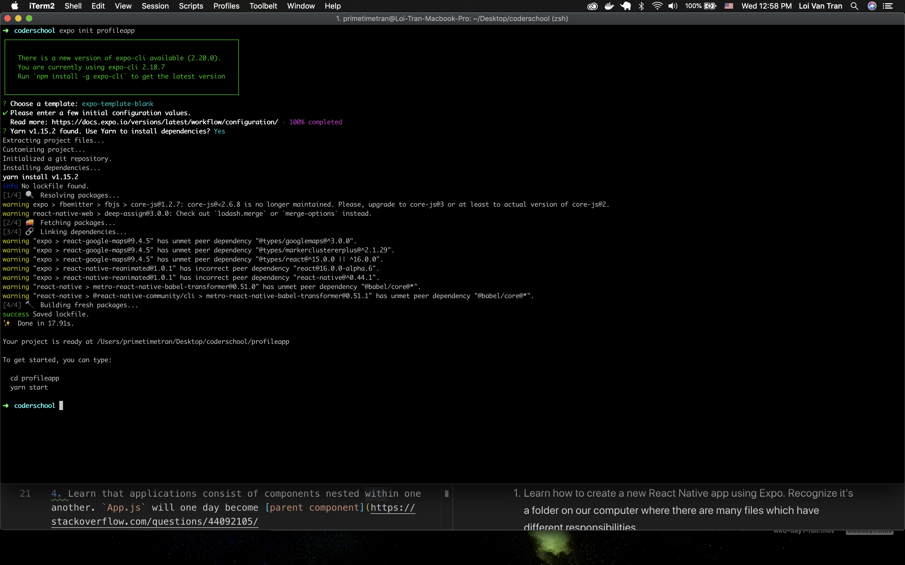
**G)** Move into the project by typing `cd profileapp`. Remember, it's just a folder on your computer.

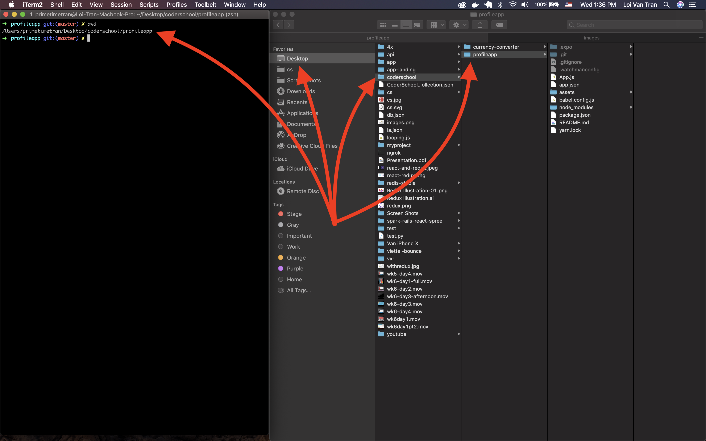

**H)** We expect this step to have problems for many of you. Try running `expo start`. If you're setup already, you should see your simulator open and a screen that looks like this.

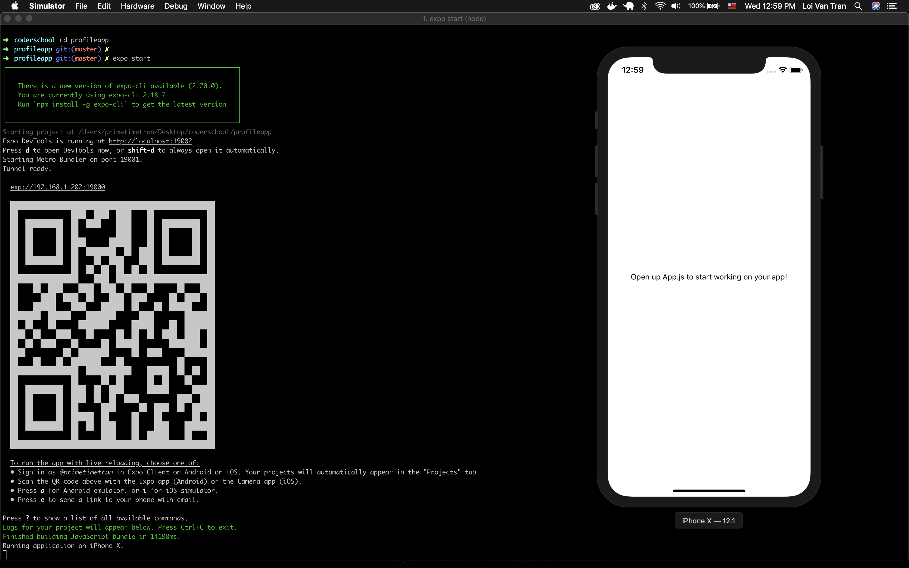


---
> **Tip** 💡: If you run into problems such as the simulator not opening, error messages, etc, refer to the documentation found at [https://docs.expo.io/versions/v33.0.0/introduction/installation/](https://docs.expo.io/versions/v33.0.0/introduction/installation/) and try figuring it out **yourself**. You'll want to know how to do this yourself in the future, trust us. Additionally, a reasonable expectation that your future bosses and teammates will have is that you can **indepdently troubleshoot** problems by **reading publically available documentation** and **following recommended steps**.

---
> Key Points 🔑📝

- We can create a new mobile app from the command line. When we run `expo init app-name` Expo creates a folder on our computer  that matches 'app-name' where all the files required for this app are. The **sky** is the limit.

---

### **Milestone 2 🛣🏃 Open ./App.js in your code editor and famaliarize yourself with it**


<details>
<summary>App.js contents</summary>

```jsx
import React from 'react';
import { StyleSheet, Text, View } from 'react-native';

export default function App() {
  return (
    <View style={styles.container}>
      <Text>Open up App.js to start working on your app!</Text>
    </View>
  );
}

const styles = StyleSheet.create({
  container: {
    flex: 1,
    backgroundColor: '#fff',
    alignItems: 'center',
    justifyContent: 'center',
  },
});
```

</details>

Your future applications will have `App.js` file/component as the parent of all other components.

Lets inspect it carefully as an example of how to build other components.

**A)** At the very top we can see the lines:

```jsx
import React from 'react';
import { StyleSheet, Text, View } from 'react-native';
```

These lines use [ES6 import, export, and default syntax](https://hackernoon.com/import-export-default-require-commandjs-javascript-nodejs-es6-vs-cheatsheet-different-tutorial-example-5a321738b50f) to grab React and some components provided for free from React Native. We could also import additional components that are part of React Native, our own custom components, and components from public libraries such as open source projects.

**B)** We can see the definition of our `App` component here:

```jsx
export default function App() {
  return (
    <View style={styles.container}>
      <Text>Open up App.js to start working on your app!</Text>
    </View>
  );
}
```

There's a few things going on here. We're defining our App `component` as the [default export](https://stackoverflow.com/questions/21117160/what-is-export-default-in-javascript) of this file, `App.js`. The name of the component typically corresponds to the name of the file. Also, we define the body of this component, `App`. It's body returns JSX. There is a `View` component that has a `Text` component nested inside it. This should look familiar to those of you who know html.

**C)** We style our application at the bottom. We see that we use StyleSheet's `create()` method and pass it an argument. The argument to it is an object. The object has keys whose values are other objects. This is where we'll style in the future.

```jsx
const styles = StyleSheet.create({
  container: {
    flex: 1,
    backgroundColor: '#fff',
    alignItems: 'center',
    justifyContent: 'center',
  },
});
```

---
> Key Points 🔑📝

- We can import components for use at the top of most files.
- We can create components by writing functions which return JSX.
- We can nest components inside of one another.

---

### **Milestone 3 🛣🏃 Begin building**

Let's get going on building that profile page.

**A)** Show our name on the app:

```jsx
export default function App() {
  // Use your own name
  return (
    <View style={styles.container}>
      <Text>Loi Tran</Text>
    </View>
  );
}
```

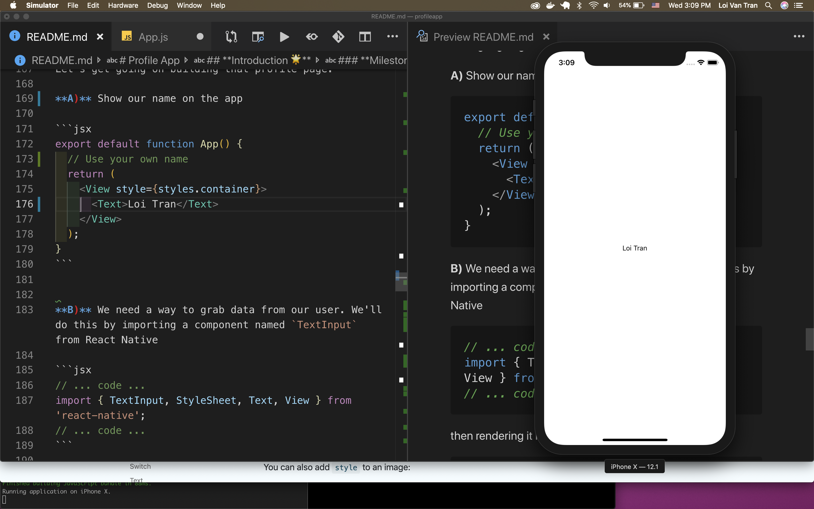
Sweet, now the user can see our name, but this could be improved. How do they know what they're looking at?

**B)** Add a description to our name:

```jsx
export default function App() {
  return (
    <View style={styles.container}>
      <Text>Name:</Text>
      <Text>Loi Tran</Text>
    </View>
  );
}
```

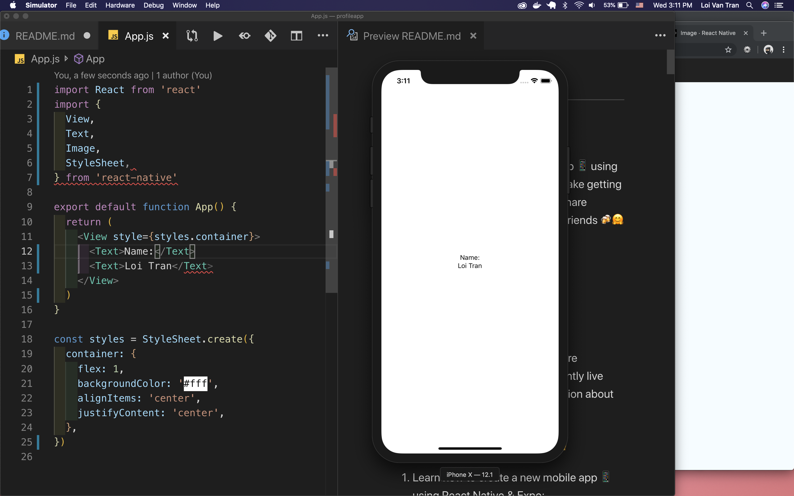
Now we've got two sibling components, interesting. Our text is quite small. Also, the two pieces of information are fundamentally different. We should treat them so.

**C)** Change the styling of the `Text` components to reflect their purpose.

```jsx
export default function App() {
  return (
    <View style={styles.container}>
      <Text
        style={{
          fontSize: 50,
          color: 'grey'
        }}
      >
        Name:
      </Text>
      <Text
        style={{
          fontSize: 30
        }}
      >Loi Tran</Text>
    </View>
  )
}
```

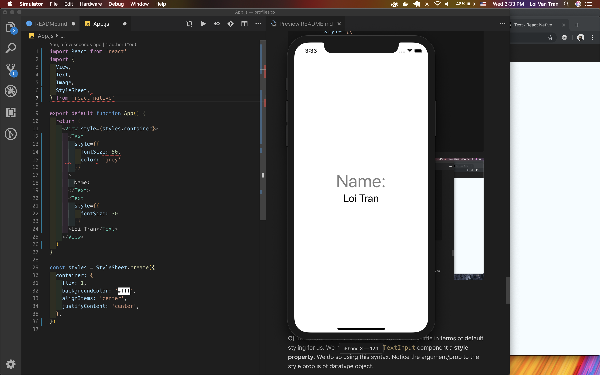

If you see a screen like this you've done well. You've added a child component to `App.js` of `Text`. There are now two `Text` siblings. We've also passed them `style` props, these props affected the way these components behaved in terms of styling.

---
> **Tip** 💡: We'll show you different syntaxes so you know additional techniques.

---

#### Different Styles 💋👔⌨

<details>
<summary>Option 1</summary>

```jsx
import React from 'react'
import { 
  View, 
  Text,
  Image,
  StyleSheet,
} from 'react-native'

export default function App() {
  return (
    <View style={styles.containerStyle}>
      <Text style={styles.labelStyle}>
        Name:
      </Text>
      <Text style={styles.nameStyle}>
        Loi Tran
      </Text>
    </View>
  )
}

const styles = StyleSheet.create({
  containerStyle: {
    flex: 1,
    backgroundColor: '#fff',
    alignItems: 'center',
    justifyContent: 'center',
  },
  labelStyle: { 
    fontSize: 50,
    color: 'grey' 
  },
  nameStyle: {
    fontSize: 30
  }
})


```

</details>
<details>
<summary>Option 2</summary>

```jsx
import React from 'react'
import { 
  View, 
  Text,
  Image,
  StyleSheet,
} from 'react-native'

export default function App() {
  const { labelStyle, containerStyle, nameStyle } = styles
  return (
    <View style={containerStyle}>
      <Text style={labelStyle}>
        Name:
      </Text>
      <Text style={nameStyle}>
        Loi Tran
      </Text>
    </View>
  )
}

const styles = StyleSheet.create({
  containerStyle: {
    flex: 1,
    backgroundColor: '#fff',
    alignItems: 'center',
    justifyContent: 'center',
  },
  labelStyle: { 
    fontSize: 50,
    color: 'grey' 
  },
  nameStyle: {
    fontSize: 30
  }
})

```

</details>

**D)** Add a profile image so the user can see you. Make sure to replace the `uri` part with a publically available image of yourself(I used Facebook).

```jsx
export default function App() {
  return (
    <View style={styles.containerStyle}>
      <Text style={styles.labelStyle}>
        Name:
      </Text>
      <Text style={styles.nameStyle}>
        Loi Tran
      </Text>
      <Image
          style={{width: 250, height: 250}}
          source={{uri: 'https://scontent.fsgn2-1.fna.fbcdn.net/v/t1.0-9/14633014_10154745913714359_6100717154322258576_n.jpg?_nc_cat=105&_nc_oc=AQkZMdfzPzbxiGhHk7rKdxZuqxfru6om8cUXLPi4elQn9yH-qtyHT1jMm8_wF2g-kp8&_nc_ht=scontent.fsgn2-1.fna&oh=0a07f00a2483ba1090d5010e8cd1eb64&oe=5DC1478A'}}
        />
    </View>
  )
}
```

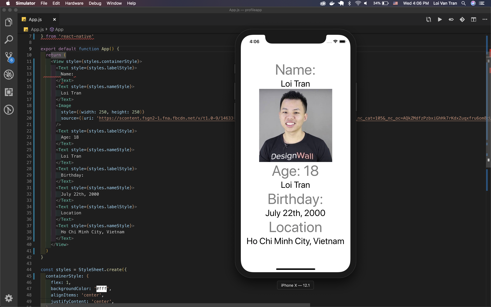
We grabbed `Image` from React Native. We nested it inside our single `View` as a child. `Image` has two sibling `Text`s. We also passed `Image` a new type of property we haven't seen before, `source`. What datatype is the property we sent to to Image? What is the shape of it...?

**E)** Let's add all our other details

```jsx
return (
    <View style={styles.containerStyle}>
      <Text style={styles.labelStyle}>
        Name:
      </Text>
      <Text style={styles.nameStyle}>
        Loi Tran
      </Text>
      <Image
        style={{width: 250, height: 250}}
        source={{uri: 'https://scontent.fsgn2-1.fna.fbcdn.net/v/t1.0-9/14633014_10154745913714359_6100717154322258576_n.jpg?_nc_cat=105&_nc_oc=AQkZMdfzPzbxiGhHk7rKdxZuqxfru6om8cUXLPi4elQn9yH-qtyHT1jMm8_wF2g-kp8&_nc_ht=scontent.fsgn2-1.fna&oh=0a07f00a2483ba1090d5010e8cd1eb64&oe=5DC1478A'}}
      />
      <Text style={styles.labelStyle}>
        Age: 18
      </Text>
      <Text style={styles.nameStyle}>
        Loi Tran
      </Text>      
      <Text style={styles.labelStyle}>
        Birthday:
      </Text>
      <Text style={styles.nameStyle}>
        July 22th, 2000
      </Text>
      <Text style={styles.labelStyle}>
        Location
      </Text>
      <Text style={styles.nameStyle}>
        Ho Chi Minh City, Vietnam
      </Text>
    </View>
  )
```


We've now got a beautiful application to help people get to know us. Amazing 🍾🎉

---

> Key Points 🔑📝

- We can combine components to create visual elements in our app like labels, text, and images.
- We can change properties as necessary to change the behavior of the components. 

---

#  Review 🤹👨🏻‍🏫🥇🏆🙋‍🧘🏻

- Recognize it's a folder 🗂on our computer containing folders 📂 & files 📄📑 which have different responsibilities 🗝🎉.

- Recognize it's parts ⚙will reflect how other components are built. It will need to import components for use & return 🚪JSX.
- Recognize it will one day become the [parent component](https://stackoverflow.com/questions/44092105/what-is-the-difference-between-child-and-parent-component-in-angular-2) of all other components in our applications. This will happen through nesting. Some components will be parents 👫 and others will be their children 👨‍👩‍👧‍👦.
- Recognize that some components are classified as [functional](https://www.robinwieruch.de/react-function-component/). Like functions, the properties/props/params/arguments we pass them will effect their behavior.